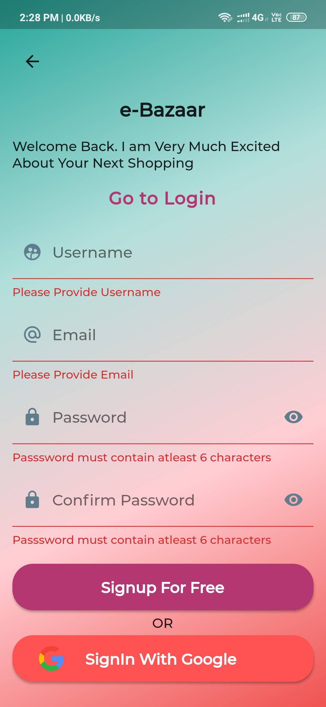
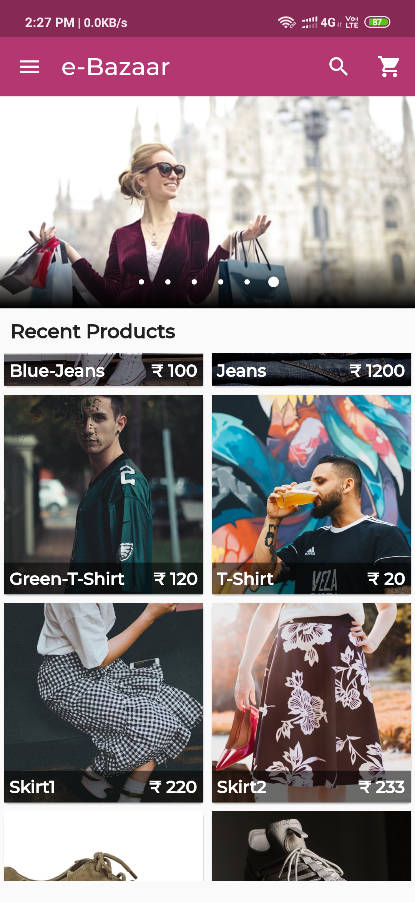
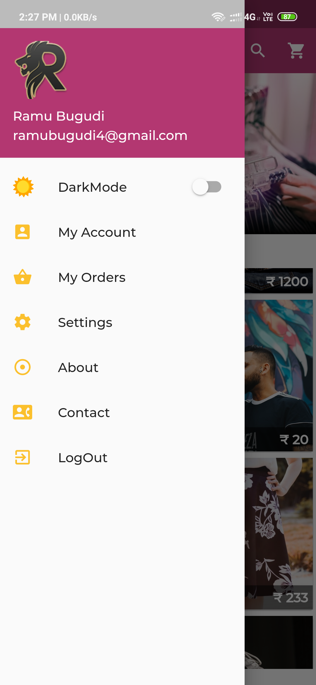
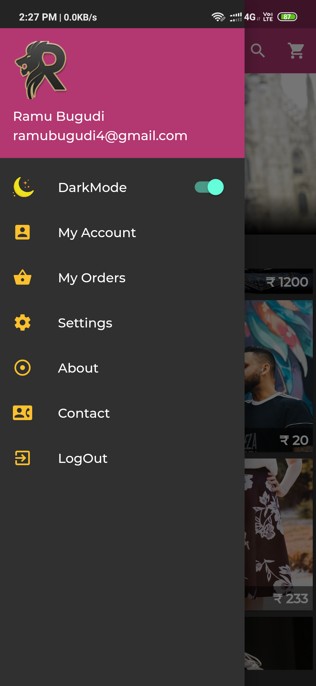
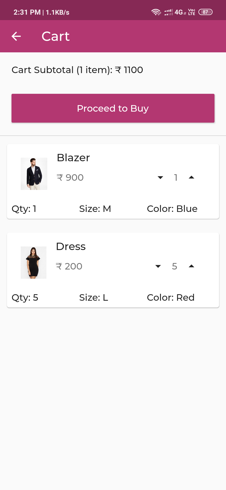
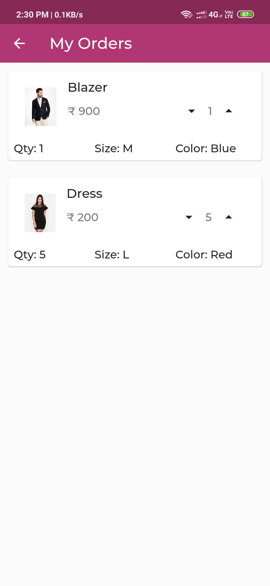
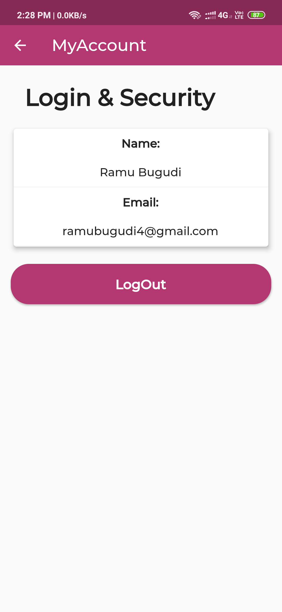
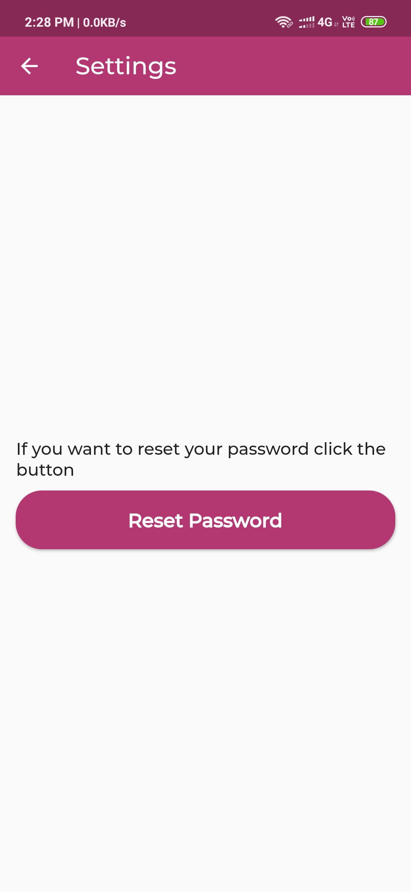
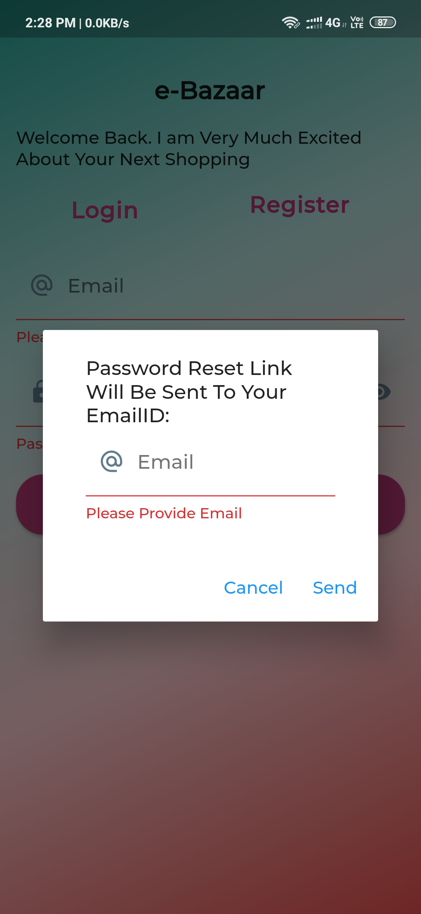

# e-Bazaar -- Under Construction

A new Flutter project.
- Some of the designs in this project are inspired from santos Enoque
- If you want to know about Flutter visit my blog once #30daysofflutter: https://allaboutflutter.blogspot.com/

# Features in e-Bazaar

- Dynamic theming switch between Dark and Light mode
- Login, Logout and Signup using Firebase
- SignInWithGoogle
- Forgot password and Resetting the Password.
- Each section has different pages and screens
- Beautiful UI with Carousel and nice Color combinations.

            
 
